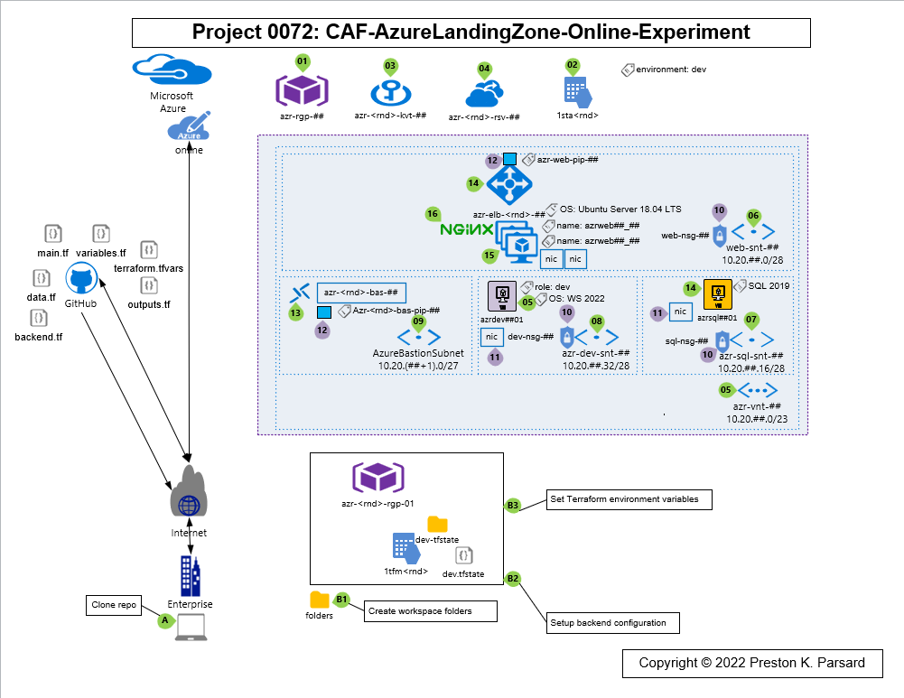

# Introduction

This project is an experiment to deploy an IaaS based Online application to the online subscription of a Cloud Adoption Framework Azure Landing Zone using Terraform

## Project Objectives

This is really just an experiment for us which aims to establish a basic framework based on my current perception of Terraform best practices (Personally, I just started learning Terraform in December 2021, so as I learn of other or better best practices, our experiment here will evolve based on the principles of continuous improvement ('kaizen', 'kanban', and 'ikigai' for my Japanese or DevOps oriented readers!) ;-).

## Getting Started

To start using this project, we recommend cloning it to your local system, set up your Terraform directory structure, create your backend state file out-of-band (i.e. in an Azure storage account and container), and set your logging environment variables for the log level and path.

## Target State Diagram

## Contribute

Please feel free to get involved by reporting problems, suggest ideas or improve this project by making the code better.
To report problems and suggest ideas, please create an issue for this script, which will ensure that it is properly addressed.
For contributing to this project, please follow the [Microsoft Open Source Code of Conduct](https://opensource.microsoft.com/codeofconduct/) for coding/testing practices and pull request requirements.
This project is released under the [MIT license](https://mit-license.org/).

## References

1. [Terraform Intro] (<https://www.terraform.io/intro/> "Terraform Intro")
2. [stackoverflow] (<https://stackoverflow.com/questions/66024950/how-to-organize-terraform-modules-for-multiple-environments/> "stackoverflow")
3. [Terraform Best Practices - Jack Roper](<https://medium.com/codex/terraform-best-practices-how-to-structure-your-terraform-projects-b5b050eab554/> "Best Practices Blog")